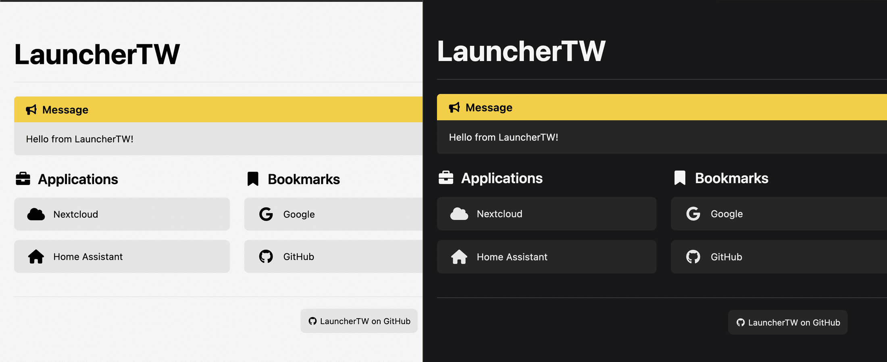

# LauncherTW

Yet another homelab dashboard with ZERO Javascript, powered by TailwindCSS and Ansible.



## Setup

### Ansible

LauncherTW is an Ansible role, which means you need to install Ansible.

### Tailwind CSS

LauncherTW uses [Tailwind CSS](https://tailwindcss.com/), specifically the `tailwindcss` CLI. To install, run:

```sh
npm install
```

## Configuration

The configuration has **two** parts: Ansible role configuration and page content.

### Ansible role configuration

Refer to [`defaults/main.yml`](defaults/main.yml) for config references.

| Variable                          | Type               | Default |
| --------------------------------- | ------------------ | ------- |
| `launchertw_build_output_dir`     | string (directory) | None    |
| `launchertw_font_awesome_version` | string             | `6.7.1` |

### Page content

Refer to [`vars.example.yml`](vars.example.yml) for page content configuration.

## Credits

- [Ansible](https://docs.ansible.com/): an open source software suite that enables Infrastructure as Code (IaC).
- [TailwindCSS](https://tailwindcss.com/): a utility-first CSS framework
- The config layout is _heavily inspired_ by [Homer](https://github.com/bastienwirtz/homer)

## License

[Apache License 2.0](LICENSE)

Copyright (c) 2022-2023 Chris Xiao
